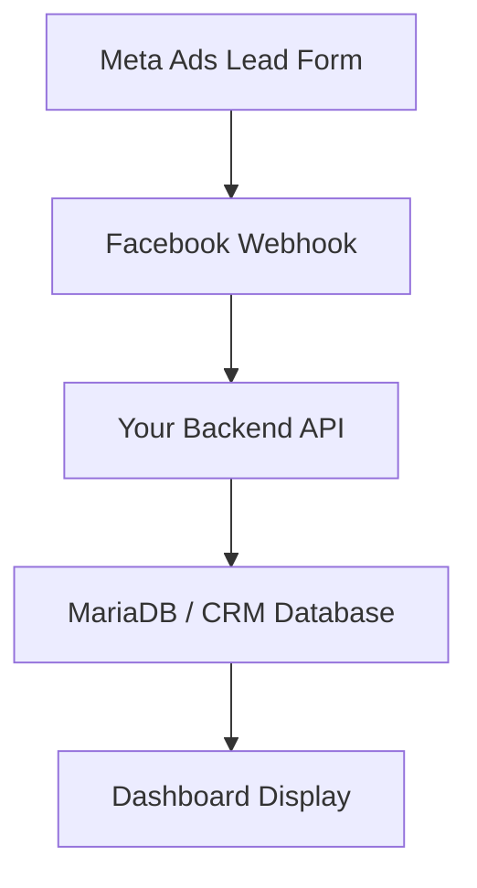

# Meta Ads Setup

This workspace now supports Meta lead ingestion into the inquiry module through a public webhook and a protected campaign performance API.

## Lead architecture

The lead capture path is structured like this:



Applied to this codebase:

- `Meta Ads Lead Form` => Meta instant form on Facebook / Instagram
- `Facebook Webhook` => Meta sends `leadgen` events to `/api/public/meta-ads/webhook`
- `Your Backend API` => the Next.js route handler verifies the webhook, fetches lead details from Graph, dedupes, and maps the lead into CRM fields
- `MariaDB / CRM Database` => inquiry data is written to `Student_Inquiry` and Meta metadata is written to `meta_ads_lead_sync`
- `Dashboard Display` => the dashboard reads stored lead data back through `/api/inquiry` and shows it on the Meta Leads page

The Graph API fetch happens inside the backend API stage. It is part of the server-side enrichment step, not a separate client-side dependency.

## What it does

- Verifies the Meta webhook challenge.
- Accepts Meta leadgen webhook events at `/api/public/meta-ads/webhook`.
- Fetches lead details from the Meta Graph API using the lead ID.
- Creates a new inquiry or links the lead to an existing inquiry when the same mobile or email already exists.
- Stores Meta-specific metadata in `meta_ads_lead_sync`.
- Surfaces campaign, form, tags, duplicate flags, filtering, and export on the inquiry listing page.
- Shows campaign reach/click/lead/spend summary on the inquiry listing page.

## Environment variables

Required for webhook ingestion when using a static server token:

```env
META_WEBHOOK_VERIFY_TOKEN=your-random-verify-token
META_ACCESS_TOKEN=your-meta-system-user-access-token
```

Recommended for secure signature validation:

```env
META_APP_SECRET=your-meta-app-secret
```

Required for campaign performance:

```env
META_AD_ACCOUNT_ID=123456789012345
```

Optional:

```env
META_APP_ID=your-meta-app-id
META_GRAPH_VERSION=v22.0
META_LEAD_NOTIFY_EMAILS=admissions@example.com,counsellor@example.com
```

## OAuth connect flow

The app now also supports a server-side Meta OAuth connect flow.

Use this when you want to connect a Meta user interactively instead of pasting `META_ACCESS_TOKEN` by hand.

Required for OAuth:

```env
META_APP_SECRET=your-meta-app-secret
NEXT_PUBLIC_META_APP_ID=your-meta-app-id
```

Flow:

1. Open the Meta Leads page.
2. Click `Connect Meta`.
3. Sign in to Meta and grant the requested permissions.
4. The callback stores the long-lived user token in the app's `meta_ads_settings` table.

Notes:

- The existing lead sync and campaign performance APIs will use the stored OAuth token first, then fall back to `META_ACCESS_TOKEN`.
- For production CRM integrations, a system user token is still the most stable option.
- OAuth is mainly useful when you need an interactive connect flow during setup or troubleshooting.

## Meta App configuration

1. In Meta for Developers, add the Webhooks product.
2. Subscribe the Page object to the `leadgen` field.
3. Set the callback URL to:

```text
https://your-domain.com/api/public/meta-ads/webhook
```

4. Use the same value from `META_WEBHOOK_VERIFY_TOKEN` as the verify token in Meta.
5. Make sure the access token in `META_ACCESS_TOKEN` can read leads and ad insights.

## Inquiry mapping

- `Inquiry_Type` => `Meta Ads`
- `Inquiry_From` => `Meta Instant Form`
- Duplicate match => latest inquiry with the same normalized mobile or same email
- Tags => stored in `meta_ads_lead_sync.tags_json`
- Campaign/form/ad metadata => stored in `meta_ads_lead_sync`

## Runtime notes

- If `META_APP_SECRET` is configured, the webhook validates `x-hub-signature-256`.
- If `META_AD_ACCOUNT_ID` is missing, the inquiry page still works, but the Meta campaign panel will show an error message.
- Notification emails are optional. If `META_LEAD_NOTIFY_EMAILS` is unset, lead sync still works.